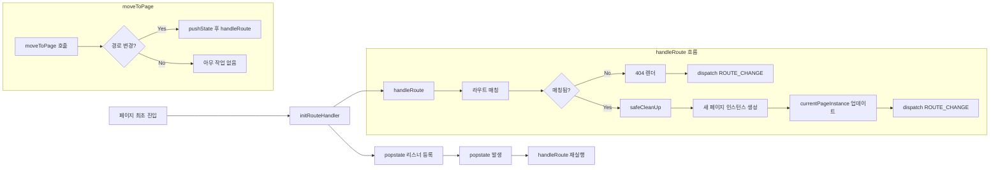

# 라우팅 path

| 경로                  | 화면                      |
| --------------------- | ------------------------- |
| `/` , `/posts`        | 게시글 목록 (무한 스크롤) |
| `/posts/create`       | 게시글 작성               |
| `/posts/:postId`      | 게시글 상세/좋아요/댓글   |
| `/posts/:postId/edit` | 게시글 수정               |
| `/login`              | 로그인                    |
| `/signup`             | 회원가입                  |
| `/user-info`          | 프로필 수정/탈퇴          |
| `/change-password`    | 비밀번호 변경             |

# 라우팅 로직 요약

- [`src/lib/router.js`](./src/lib/router.js)

